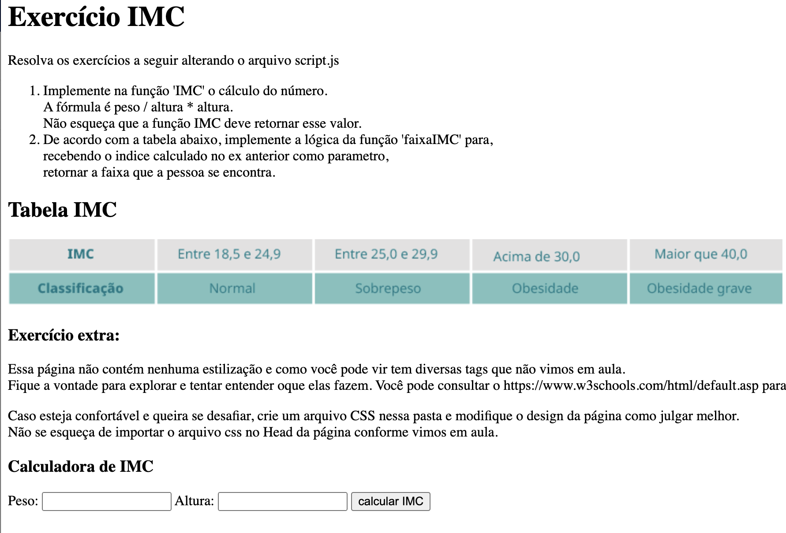

# Tarefa - Dia 6: Front End (Internet e aplicativos - Parte 1)

## Exercício IMC

Abra a pasta Exercicio IMC no VSCode (ou o editor de texto da sua escolha) e abra o arquivo index.html no seu browser. 
Lá estão os enunciados dos exercícios.

Bastante código já foi dado, você deve trabalhar na implementação da lógica das funções `calculoIMC` e `resultadoIMC` que estão no arquivo script.js.

Encorajamos que estudem o arquivo HTML e a função pegarValores que foi dada no arquivo script.js para tentar entender o que elas fazem.
Não se preocupe com entender tudo! É o início das suas investigações, é normal que fiquem dúvidas.

### Instruções de envio

Faça o commit em sua máquina local e depois suba a solução para o seu repositório no GitHub. Envie a solução no formulário disponibilizado no canal **#💪tarefa-dia-5**. Caso não esteja conseguindo utilizar o GitHub, envie a solução para o Google Drive ou qualquer outra plataforma e disponibilize o link no formulário (não esqueça de tornar o arquivo público no seu Google Drive).

Segue um print da tela com os enunciados.

