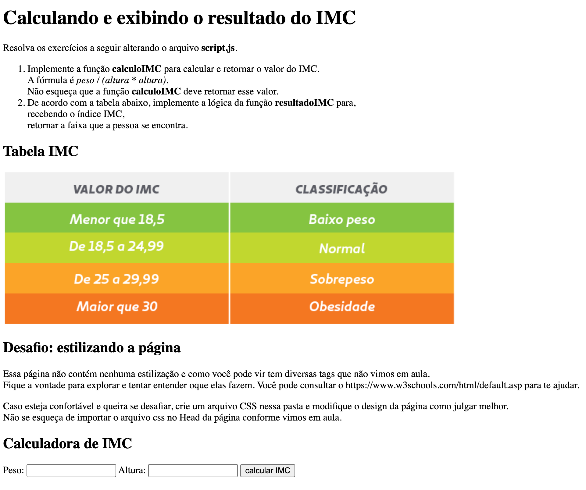

# Tarefa Opcional - Dia 5: Front-End (Internet e aplicativos - Parte 1)

Na tarefa opcional do dia 5, faremos um programa em uma página web que calcula o IMC (Índice de Massa Corporal)!

## Antes de começar

Antes de começar a programar, vamos organizar mais uma vez a pasta onde você está desenvolvendo as tarefas:
1. Nela, você criou as pastas `tarefa-dia-1`, `tarefa-dia-2`, `tarefa-dia-3` e `terafa-dia-4`. Agora crie a pasta `tarefa-dia-5` (de preferência, pelo terminal :D).
1. Agora baixe [este arquivo .zip](https://drive.google.com/file/d/15ctNbKhByDzev0jXT9pzuWymSzhyEKD8/view?usp=sharing) chamado `site-imc` e descompacte-o no seu computador.
1. A descompactação vai gerar uma pasta chamada `site-imc`. Utilizando a interface de usuário (ou seja, **sem ser** pelo terminal), copie esta pasta e cole na pasta `tarefa-dia-5`.
1. Agora execute os comandos git (`git pull`->`git status` -> `git add *` -> `git commit -m 'mensagem de commit'` -> `git log` -> `git push`) no terminal para subir essa atualização no seu repositório remoto do GitHub.

Pronto, agora bora programar!

## Calculando o IMC

A sua tarefa será desenvolver o código que faz o cálculo do IMC! Vamos lá:

1. Abra no VSCode a pasta que você está colocando todas as suas tarefas (ou seja, a pasta raiz do seu repositório local)
1. Agora abra o arquivo `index.html` no seu navegador. Para isso, basta clicar 2 vezes com o mouse no arquivo que ele será aberto automaticamente no seu navegador (isso você faz **sem ser** no terminal, pela interface do computador mesmo).
1. Leia as instruções presentes na página e desenvolva a solução pedida. Bastante código já foi dado. Você deve trabalhar na implementação da lógica das funções `calculoIMC` e `resultadoIMC` que estão no arquivo `script.js`.
1. Encorajamos que estude o arquivo HTML e a função `pegarValores` que foi dada no arquivo `script.js` para tentar entender o que elas fazem. Não se preocupe com entender tudo! É o início das suas investigações, é normal que fiquem dúvidas.
1. Veja se sua solução está funcionando abrindo o arquivo `index.html` no seu navegador e preenchendo as informações de IMC. Se funcionar, significa que o código deu certo!
1. Se não funcionou, verifique se recebeu alguma informação de erro abrindo o console do seu navegador.
1. Para abrir o console, pressione as teclas `Command` + `Option` + `J`* para o MacOS (ou `Ctrl` + `Shift` + `J` para o Windows)
1. Terminando o exercício, suba as alterações para o seu GitHub.

## Enviando a sua tarefa no nosso Discord

 Para enviar a tarefa, basta copiar o link do seu repositório no GitHub e colar no formulário solicitado no [Discord do curso](https://discord.com/invite/kHS84D2hA4) no canal **#💪tarefa-dia-5-opcional**.

 **Não sabe qual é o link do seu repositório?** Entre em github.com e clique no seu perfil no canto superior direito da tela (onde tem um círculo com uma setinha para baixo). Em seguida, clique em "Your repositories". Lá você vai ver o nome do repositório que você criou. Clique nele e em seguida copie o link do navegador e cole o link no formulário.

Segue um print da tela com os enunciados.

